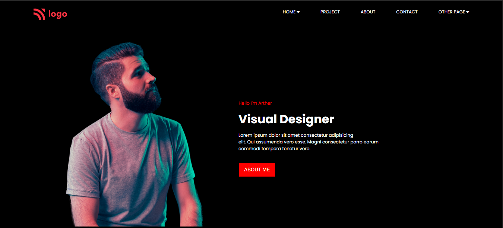
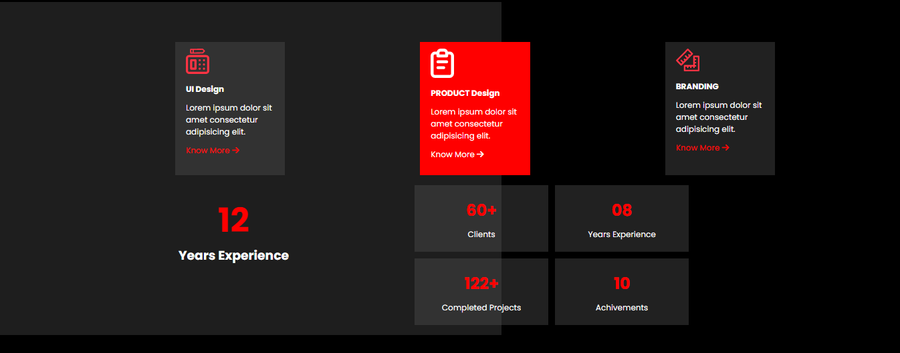
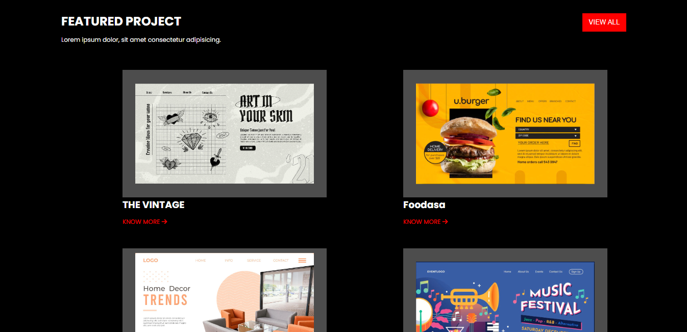
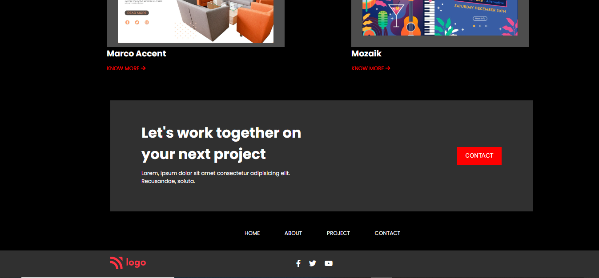

# Project-15 | Visual Designer
## Technology That I use

## Features

- Mobile Responsive.
- Tablet Responsive.
- Fullscreen Responsive.

## What I learn from this projects

- How to position any element.
- How to make button.
- How to Responsive.
- Imports icons from fontawesome. 
- Css Grid.
- Css Flexbox.

## Complete Time

- It's takes near about 8 Hrs.